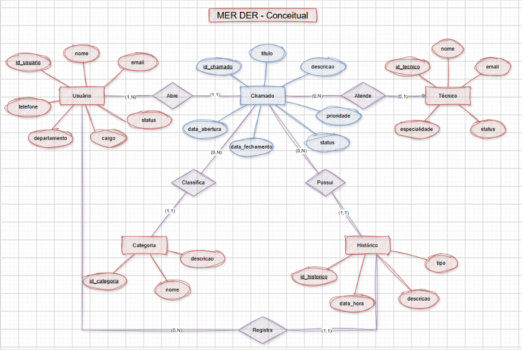

# Banco de Dados - Atendimento a Chamados

## Tema 01 - Atendimento a Chamados

Esse trabalho foi feito para a atividade de Banco de Dados do curso de Desenvolvimento de Sistemas.
A ideia do banco é organizar um sistema de atendimento de chamados de TI, onde podemos cadastrar usuários, técnicos, categorias, chamados e o histórico dos atendimentos.

## MER DER Conceitual

## MER DER Lógico

## Normalização

O banco foi organizado usando as formas normais.

1FN: Cada campo possui apenas uma informação e não tem dados repetidos.

2FN: Os campos dependem da chave primária da tabela.

3FN: As informações foram separadas em tabelas para evitar repetir os mesmos dados.

## Tabelas

O banco possui as seguintes tabelas:

Usuario
Tecnico
Categoria
Chamado
Historico

## Dicionário de Dados

### Usuario
| Campo        | Tipo         | Chave | Descrição                |
| ------------ | ------------ | ----- | ------------------------ |
| id           | int          | PK    | Identificação do usuário |
| nome         | varchar(100) | -     | Nome do usuário          |
| email        | varchar(100) | -     | Email                    |
| telefone     | varchar(20)  | -     | Telefone                 |
| departamento | varchar(50)  | -     | Departamento             |
| cargo        | varchar(50)  | -     | Cargo                    |
| status       | enum         | -     | Status do usuário        |

### Tecnico

| Campo         | Tipo         | Chave | Descrição                |
| ------------- | ------------ | ----- | ------------------------ |
| id            | int          | PK    | Identificação do técnico |
| nome          | varchar(100) | -     | Nome do técnico          |
| email         | varchar(100) | -     | Email                    |
| especialidade | varchar(50)  | -     | Especialidade do técnico |
| status        | enum         | -     | Status do técnico        |

### Categoria

| Campo     | Tipo         | Chave | Descrição                  |
| --------- | ------------ | ----- | -------------------------- |
| id        | int          | PK    | Identificação da categoria |
| nome      | varchar(50)  | -     | Nome da categoria          |
| descricao | varchar(100) | -     | Descrição da categoria     |

### Chamado

| Campo           | Tipo         | Chave | Descrição                   |
| --------------- | ------------ | ----- | --------------------------- |
| id              | int          | PK    | Identificação do chamado    |
| titulo          | varchar(100) | -     | Título do chamado           |
| descricao       | text         | -     | Descrição do problema       |
| data_abertura   | datetime     | -     | Data de abertura            |
| data_fechamento | datetime     | -     | Data de fechamento          |
| status          | enum         | -     | Status do chamado           |
| prioridade      | enum         | -     | Prioridade                  |
| id_usuario      | int          | FK    | Usuário que abriu o chamado |
| id_categoria    | in_          |       |                             |
